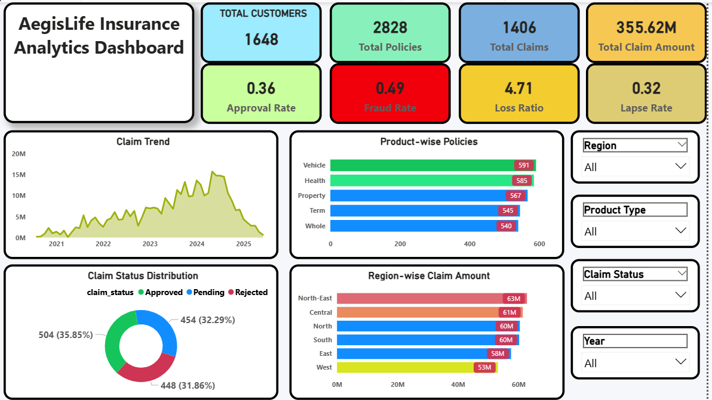
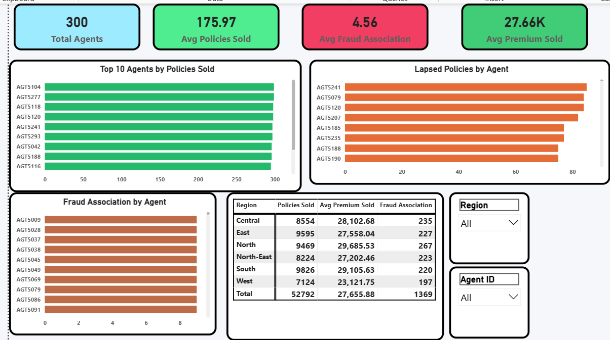
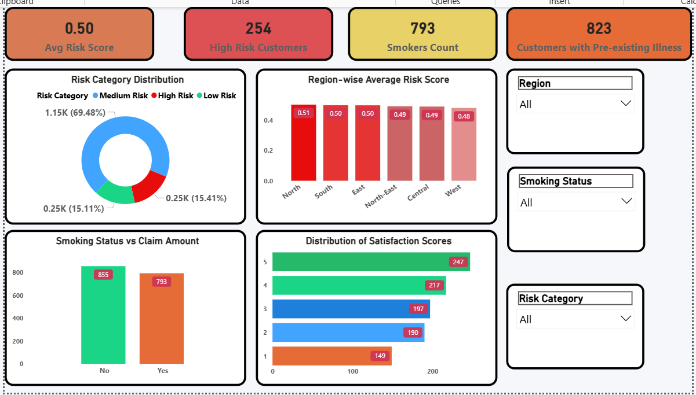

# AegisLife Insurance Analytics

End-to-End Insurance Analytics Project using Python, SQL, and Power BI including Data Cleaning, EDA, Hypothesis Testing, Business Insights, and Interactive Dashboards.

---

## Project Overview

AegisLife Insurance Analytics is an end-to-end analytics project focused on analyzing insurance operations, customer risk profiles, claims performance, fraud indicators, and agent productivity.

---

## Tools & Technologies

- Python (Pandas, NumPy, Matplotlib, Seaborn, SciPy)
- MySQL
- Power BI
- Excel
- Git & GitHub

---

## Dashboard Preview

### Executive Dashboard

### Agent Performance Dashboard

### Customer Risk Dashboard

---

## Connect With Me

LinkedIn: https://www.linkedin.com/in/vishalchauhan10k  
GitHub: https://github.com/vishaldataanalyst